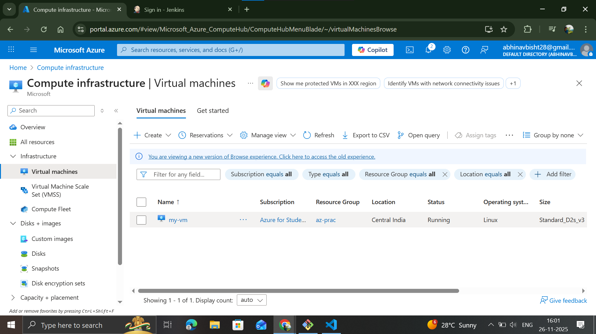
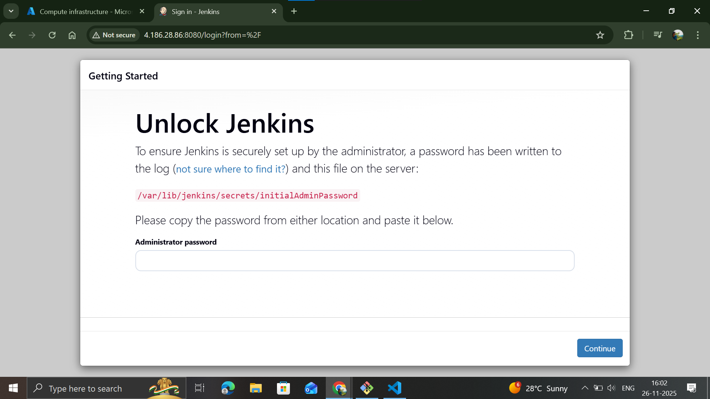

 cloud-> set of data-centers containg servers/computer thats job is to run your app(provide resources) 24/7.
 (public, private, hybrid, community)

 cloud computing-> working with cloud

benefits-> scalability, high-avability, disaster recovery

 virtualization-> implemented by hypervisor, method of logically breaking a server into multiple servers. May have already taken place or may happen on call.

 Avability Zone-> data centers, Region->geographical area with multiple data-centers. (spread for reduced latency)

## Azure

provides: IAAS(VM), PAAS(DB), SAAS(Outlook)

# resource, resource groups
what you create using a service is a resource created by azure resource manager(as per your configs)(for both ui and cli).

resource groups are groups of various different types of resources created, helps: tracking and managing(access, permissions etc). generally grouped by project and environments. a single resource can have only 1 resource group attatched.

# vms

A-series: retiring
Bs-series: free trial, leaarning, pocs
D-series: general purpose
E-series: memory optimized(redis)
F-series: compute intensive(multi threaded, batch apps, gaming)
G-series: more memory and storage optimized
H-series: high performance
Ls-series: storage optimized(DBs)
M-series: in-memory workload(largest)
N-series: gpu enables(ML)

chmod 600 (pem-file) //making pem file less accessible
ssh: ssh -i (path to pem file) (username)@(public ip)

vmss(virtual machine scale set): auto-scaling(aws)

practiced setting up jenkins on a azure-vm.

# networking