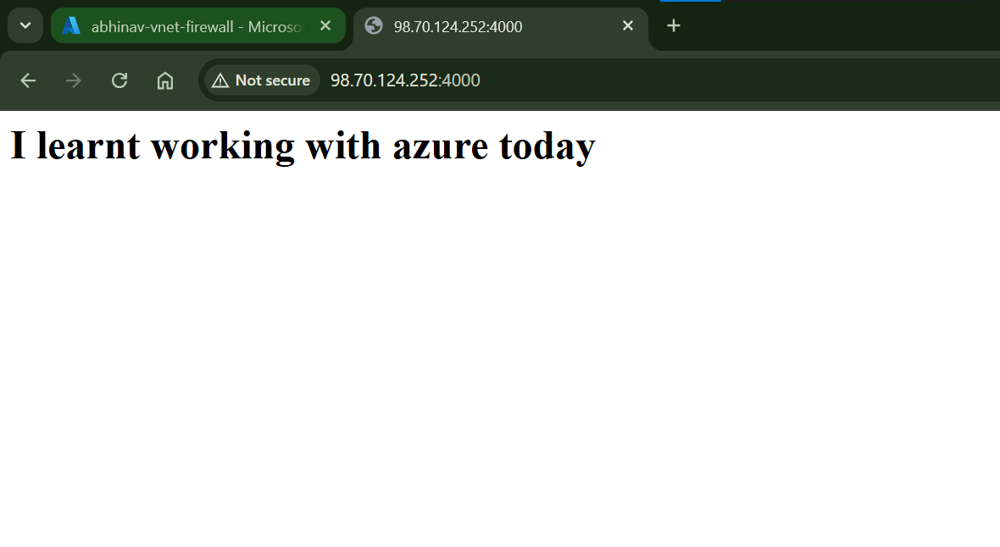

# Azure networking

## Virtual Network(VNET)
VPC in AWS

why? if multiple VMs on same physical server and one gets hacked other VMs would be vulnerable too. VNET prevents this.

azure creates diff virtual networks for clients in which only they operate, provide logical isolation oover the same machine.

size=> no. of ip add, using cidr (standard /16)

VNET is further logically seperated ino subnets, and we can have diff SGs on each part. for subnets too size determined using cidr.

SG(aws) = NSG(azure), can be created for subnets and instances.
can be setup for 1 internet facing subnet to access a non-internet facin subnet.
ASG=> enganced NSG, can create a group even within the subnet for accessing something.

This setup can be considered synonimous to a gated society.

each subnet contains a route table that contains system routes which tell how to move in a perticular subnet.

use copy of subnets in diff avability zone for higher availability. an aditional gateway is created called the app gateway subnet(app gateway), which balance load across multiple instances. this LB is given a DNS. Thus by hitting urls we hit loadbalancers and it maps us further. 

the other load balancers used for internal routing are just azure load balancers.

An azure firewall works at VNET level to manage traffic

2 VNETs , if resource from one wants to access resource form other you perform peering(need to be an administrator on both) i.e., go to the routes of one VNET and add the routing path to other VNET-> ways: VNET peering, VNET gateway 

to set up a connection bw an on-premise network and the azure network=> VPN gateway

The significance of priority in cases like setting inbound rules or firewall policy is that if multiple people have set diff rules for same resource, which shall take priority.(100-65536, the lower the stronger)

# Activity

created a private VNET with a vm in it, so no public ip. To ssh into it using bastion(service), acts as a proxy bw devs and private app(by setting up DNAT rule in firewall policy). You can setup log monitoring, iams for the bastion itself. Once you have set up the firewall rule collection and the required rules, as per your setup you will be able to access your website on your firewall public ip.

# Interview Questions

NSG VS ASG-> NSG=provide indivisual ip adds, ASG used in combination to make group vms and instead of indivual ip add entire ASG.

inside a subnet all resources can access each other by defalut, if you wnat to prevent this you need to create permission deny inbound rules with higher priority compared to to the allow rules.

NSG are stateful(if on a port inbound is allowed, output allowed automatically)....NACL in aws(stateless)

firewall(for VNET) vs NSG(for subnet or indivisual resources)

App Gateway(L7, strong(http), host-based and path-based routing, WAF(web application firewall)) VS Load Balancer(L4, taffic over ip,TCP/UDP)

company software traffic flow!? user->DNS->firewall(Nating rule)->VPC->Subnet->NSG->app(vm), may use a bastion for engineers
