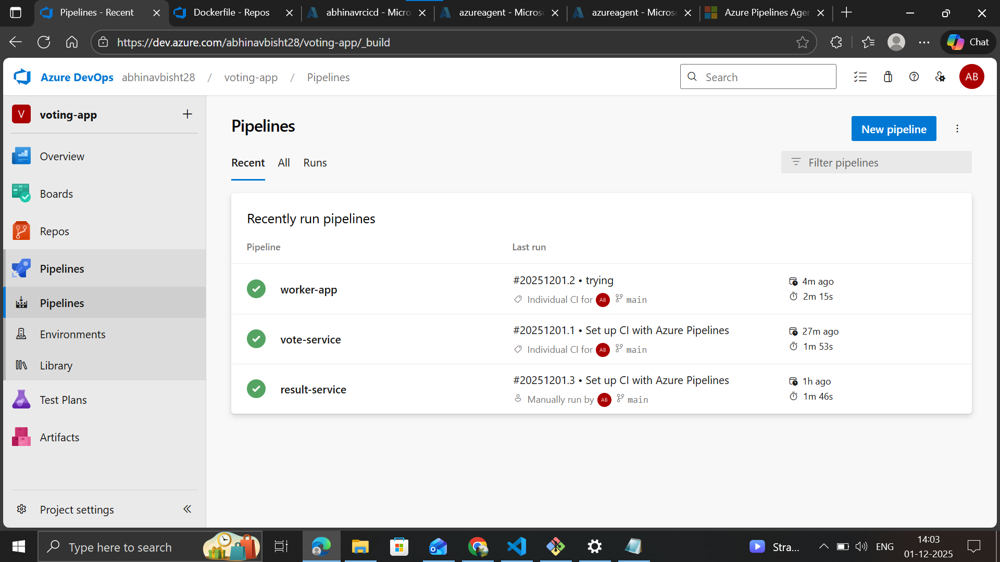

# Azure DevOps

set of services to improve SDLC

- boards-> jeera
- repos-> code(version control)
- pipelines-> CI/CD
- test plans-> plans, runs, report
- artifacts-> outcomes of cicd

# project-1(CI)

- cloned the repo from git to azure-repo: 

- set up a container registry
- set up an agent on an ubuntu vs as, azure doesnt provide prebuilt agents with free account
- agent running and listening for jobs on vm: 
 
- created 3 pipelines, 1 for each microservice(node, python and .net), they build the images and push them to the registry.
