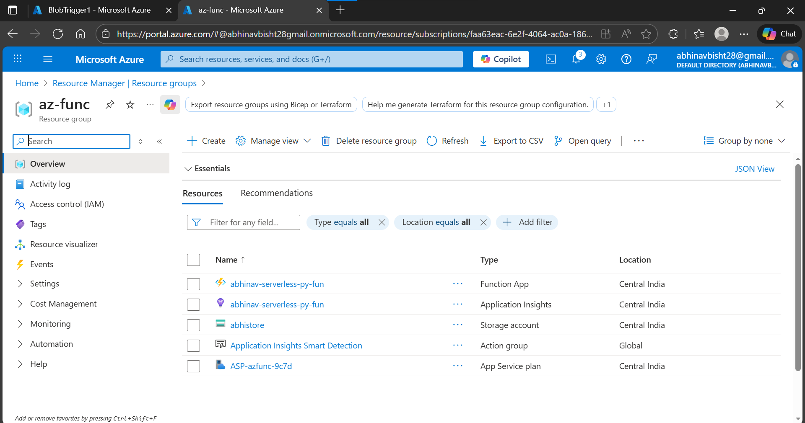
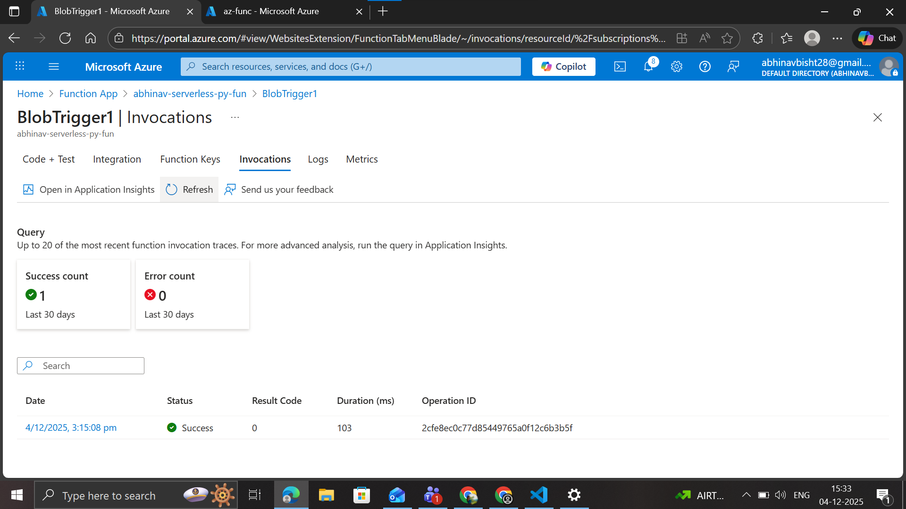
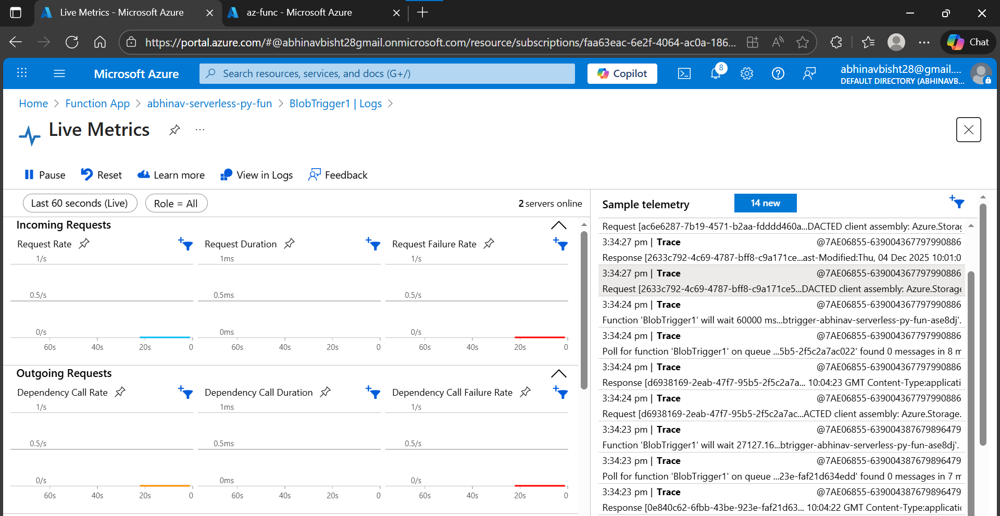

# Serverless

dynamic alloc and dealloc of servers

Azure Function(like AWS Lambda), need to create function app before creating the functions(configure details like region, runtime etc)

# Activity
practicing event based triggering by creating a blob storage(+storage account) and create a azure function(+function app) with python RTE such that when you insert anything in the storage, you get deatils about it in the funtion logs, further if you want you can perform other actions like compression/deletion beyon a certain size(by modifying the python code).

resources created:

invocation:

live metrics:
